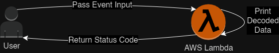

# Battery Health Monitor

This project enables seamless monitoring of battery health by sending, receiving and interpreting hexadecimal data in real-time to AWS.



## Usage

To use this script, you need to pass an event to the main function. The event should be a dictionary with the following structure:
```
{
    "device": string,
    "payload": string
}
```

The device is a string that represents the name of the device. The payload is a hexadecimal string that represents the payload from the device.

The main function will decode the payload and print the decoded data in the following format:
```
{
    "device": string,
    "time": integer,
    "state": string,
    "state_of_charge": float,
    "temperature": float
}
```

## Prerequisites

- Access to a test environment on AWS
- An Access Key and Secret Access Key from AWS IAM
- Running Docker

## Local Development in VSCode

### VSCode Setup
We use Dev Containers to ensure that all users have the same VSCode settings. All additional extensions should be added into the `devcontainer.json` in a separate PR.
1. Open the Repo folder in VSCode
2. Ctrl+Shift+P and type in "Dev Containers: Reopen in Container"

### AWS Setup
1. Ctrl+Shift+P and type in "AWS: Create Credentials Profile"
2. Add your Access Key and Secret Access Key that you got from AWS IAM
3. Ctrl+Shift+P and type in "AWS: Show or Hide Regions" and choose your respective region

### Development
Everything should be ready to run. In `./Makefile` you can find shortcuts for frequently used commands.
- To run terraform locally, enter `make terraform-run-dev`
- To run the unit tests for the Lambda function, enter `make test-battery-health-monitor`


## Deployment

### Locally
As mentioned, you can deploy terraform locally by running `make terraform-run-dev`

### QA
Before merging to Prod, the Infrastructure should be tested in a QA infrastructure on AWS.
This happens automatically via GitHub Actions after merging to the QA branch.
Merging into QA only passes, if all Unit Tests pass and the linting looks okay.

### Prod
After everything was reviewed in the QA platform, you can merge the QA branch into the Main branch.
Same CI/CD process as in QA.
